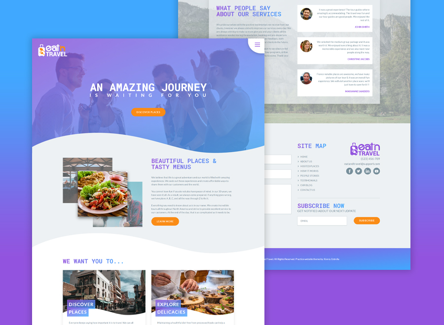

## Eat & Travel Homepage
 
This is a project I did last year after I finished a course in Udemy, **Advanced CSS and Sass: Flexbox, Grid, Animations and More! by Jonas Schmedtmann**. I would recommened that course for someone who wants to learn Web Development, the explanations are well presented and the teacher is very good.

Live Site URL: [Live Demo](http://jklmthreads.com/coding-projects/eat-and-travel/)

## What I learned in this project:

- Advanced CSS animations with @keyframes, animation and transition
How CSS works behind the scenes: the cascade, specificity, inheritance, etc.
- CSS architecture: component-based design, BEM, writing reusable code, etc.
- Flexbox layouts: build a huge real-world project with flexbox
- CSS Grid layouts: build a huge real-world project with CSS Grid
Using Sass in real-world projects: global variables, architecting CSS, managing media queries, etc.
- Advanced responsive design: media queries, mobile-first vs desktop-first, em vs rem units, etc.
- SVG images in HTML and CSS
- Responsive images in HTML and CSS for faster pageloads
- The NPM ecosystem: development workflows and building processes